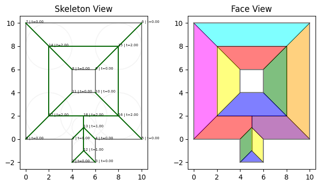
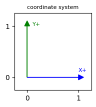
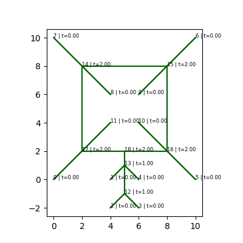
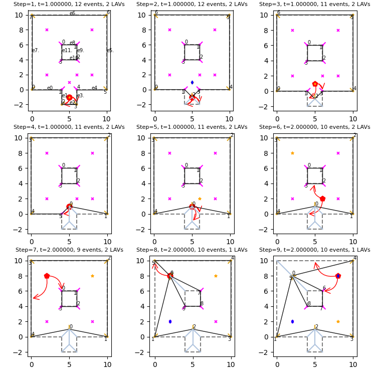
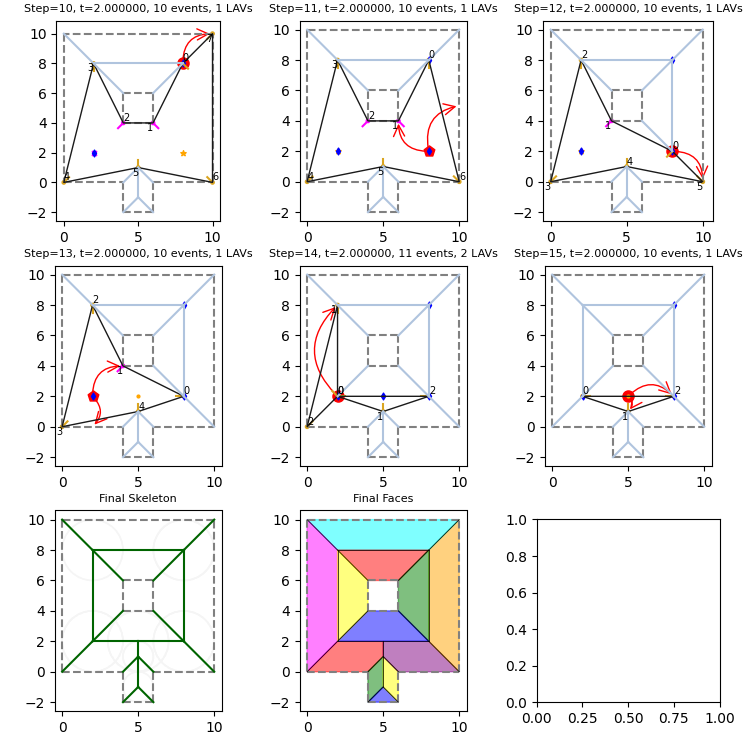

# py_straight_skeleton

Implementation of [Straight Skeleton](https://en.wikipedia.org/wiki/Straight_skeleton) computation, with minimal
dependencies.

To the best of our knowledge, our **results compete or surpass** some of the top libraries to compute straight skeletons
of simple polygons. By "surpassing" we mean that, in our tests, our library can properly support polygons that other
libraries can not.

Please note, however, that the code is designed for readability and ease of use, and not necessarily for
runtime **performance**.

Our implementation uses a novel modification of _Felkel, Petr & Obdržálek, Štěpán (1998)_ algorithm, to address some shortcomings found during its evaluation, which failed to compute proper skeletons for several of our test cases.

Input | Result
:---------------------------------------:|:---------------------------------------:
 | 

## Installation

The code is available in [pypi](https://pypi.org/project/py_straight_skeleton/):

```sh
pip install py_straight_skeleton
```

## Usage

```text
    📝 Note: We use (+X right, +Y up) axes as our coordinate system.
```

&nbsp;&nbsp;&nbsp;&nbsp; 

```python
# Define your polygon (counter-clockwise) with optional holes (clockwise).
TEST_EXTERIOR = [[0, 0], [4, 0], [4, -2], [6, -2], [6, 0], [10, 0], [10, 10], [0, 10]]
TEST_HOLES = [[[4, 6], [6, 6], [6, 4], [4, 4]]]

from py_straight_skeleton import compute_skeleton
skeleton = compute_skeleton(exterior=TEST_EXTERIOR, holes=TEST_HOLES)
```

Check [examples/demo.ipynb](examples/demo.ipynb) for a full example with plotting and skeleton parsing.

Skeleton parsing is generally done via three methods:

```python
# 
# @property
# nodes(self) -> list[SkeletonNode]:
# 
print(skeleton.nodes)

[SKN(0, 0.000, 0.000, 0.00000), SKN(1, 4.000, 0.000, 0.00000), SKN(2, 4.000, -2.000, 0.00000), SKN(3, 6.000, -2.000, 0.00000), SKN(4, 6.000, 0.000, 0.00000), SKN(5, 10.000, 0.000, 0.00000), SKN(6, 10.000, 10.000, 0.00000), SKN(7, 0.000, 10.000, 0.00000), SKN(8, 4.000, 6.000, 0.00000), SKN(9, 6.000, 6.000, 0.00000), SKN(10, 6.000, 4.000, 0.00000), SKN(11, 4.000, 4.000, 0.00000), SKN(12, 5.000, -1.000, 1.00000), SKN(13, 5.000, 1.000, 1.00000), SKN(14, 2.000, 8.000, 2.00000), SKN(15, 8.000, 8.000, 2.00000), SKN(16, 8.000, 2.000, 2.00000), SKN(17, 2.000, 2.000, 2.00000), SKN(18, 5.000, 2.000, 2.00000)]

# 
# get_faces(self) -> list[SkeletonFace]
# 
for face_idx, face in enumerate(skeleton.get_faces()):
    nodes_pos = [skeleton.nodes[v_idx].position for v_idx in face]
    print(f"face {face_idx} -> {nodes_pos}")

face 0 -> [Vector2(0.000, 0.000), Vector2(4.000, 0.000), ...]
face 1 -> [Vector2(4.000, 0.000), Vector2(4.000, -2.000), ...]
face 2 -> [Vector2(4.000, -2.000), Vector2(6.000, -2.000), ...]
face 3 -> [Vector2(6.000, -2.000), ...]
...
face 11 -> [Vector2(4.000, 4.000), Vector2(4.000, 6.000), ...]

# 
# arc_iterator(self) -> Iterator[tuple[SkeletonNode, SkeletonNode]]
# 
for skv1, skv2 in skeleton.arc_iterator():
    print(f"{skv1.position} -> {skv2.position}")

Vector2(4.000, -2.000) -> Vector2(5.000, -1.000)
Vector2(6.000, -2.000) -> Vector2(5.000, -1.000)
Vector2(6.000, 0.000) -> Vector2(5.000, 1.000)
...
Vector2(8.000, 2.000) -> Vector2(5.000, 2.000)
Vector2(2.000, 2.000) -> Vector2(5.000, 2.000)
```

## Visualization

The [plotting module](src/py_straight_skeleton/plotting.py) provides several utilities to plot results and intermediate
steps of the algorithm for debugging and verification.

Eg:

```python
# skeleton = ...

import matplotlib.pyplot as plt
fig, ax = plt.subplots(figsize=(4, 4))
ax.set_aspect("equal")

from py_straight_skeleton.plotting import Utils
Utils.plot_skeleton(skeleton, ax=ax, show_vertex_info=True)

fig.savefig("output.png")
```



## Debugging

The [plotting module](src/py_straight_skeleton/plotting.py) also provides a `PlotTracer` that can help debug steps,
although we encourage opening issues in the repository for help if necessary.

```python
import logging
from py_straight_skeleton import compute_skeleton
from py_straight_skeleton.algorithm import set_global_algorithm_tracer
from py_straight_skeleton.plotting import PlotTracer

# Define your polygon (counter-clockwise) with optional holes (clockwise).
TEST_EXTERIOR = [[0, 0], [4, 0], [4, -2], [6, -2], [6, 0], [10, 0], [10, 10], [0, 10]]
TEST_HOLES = [[[4, 6], [6, 6], [6, 4], [4, 4]]]

# Set plot tracer to be notified by the algorithm steps and output to a folder.
plot_tracer = PlotTracer(
    fig_cs=2.5, 
    step_fig_ncols=3, 
    step_fig_nrows=3, 
    log_level=logging.INFO, 
    output_dir="examples/plot_tracer_output/",
)
set_global_algorithm_tracer(plot_tracer)

skeleton = compute_skeleton(exterior=TEST_EXTERIOR, holes=TEST_HOLES)
```



