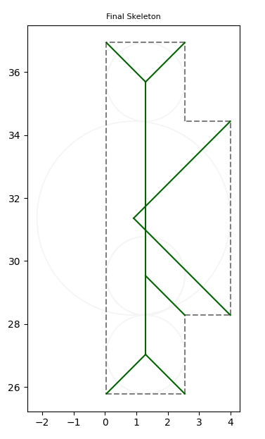

# Detected Failure

```python
Vector2(0.040, 36.940)
Vector2(0.040, 25.780)
Vector2(2.540, 25.780)
Vector2(2.540, 28.280)
Vector2(3.990, 28.280)
Vector2(3.990, 34.440)
Vector2(2.540, 34.440)
Vector2(2.540, 36.940)
```

The problem is that in Step 5, the resulting bisector for the created node is not correct. It points in the same direction as the skeleton arc, but should point in the same direction as the old node. Arguably, that event should happen after the event between vertices 3 and 4, but both have the same time 1.25, while this one being distance 0 with respect to the vertex itself.


Possible solutions:

* A. Do not prioritize events based on distance, when the tie for priority
  * This may make other cases that work suddently not work
* B. Re-compute the bisector of the generated vertex after 4 meets 0.
  * Theoretically, the edges that are collapsing (e6 and e3) do compute the bisector properly. The problem is that e6 is not the only edge being carried by vertex 4, also e0 is, which would yield the proper bisector in this case.  


The commit change attached to this investigation is opting for A, since we were able to validate a battery of tests against the change. However, this confirms the need for a comprehensive battery of tests.

| Before | After |
|:-------------:|:-------------:|
|  |  |
